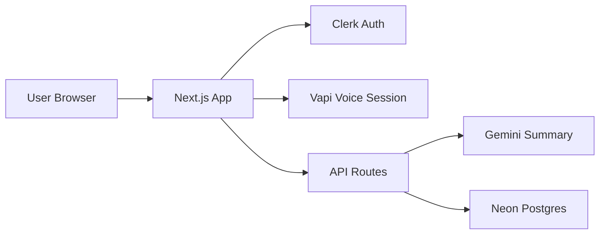

# EchoMind AI

A voice-first mental wellness companion that turns conversations into private, structured reflections and session history.

## Overview
EchoMind AI is a web app that helps users talk through their thoughts using a real-time voice assistant, then saves each session with a concise summary they can revisit later. It blends conversational UX with lightweight journaling so people can reflect without needing to type or structure their thoughts upfront.

## Why I Built This
Access to mental wellness support is limited, and many people struggle to start or maintain a journaling habit. I built EchoMind AI to make emotional check-ins feel more natural by combining voice, gentle guidance, and automatic summarization. The goal is to lower the barrier to self-reflection while staying transparent about safety and privacy.

## Why It's Useful for Users
- Voice-first sessions feel more natural than typing during stressful moments.
- Automatic summaries help users review key themes and track progress over time.
- Session history provides continuity and encourages consistent reflection.
- Built-in safeguards and disclaimers set clear expectations and responsible usage.

## Key Features
- Real-time voice sessions powered by Vapi.
- AI-generated session summaries using Gemini.
- Secure authentication with Clerk.
- Session history stored in Postgres (Neon) via Drizzle ORM.
- Free trial vs. premium call credits UI and flow.
- Safety disclaimer and crisis-resource modal.

Note: The premium payment flow is currently mocked in the UI and can be wired to a real provider (Razorpay SDK already included).

## Tech Stack
- Next.js 15 (App Router)
- React 19
- Tailwind CSS
- Clerk (auth)
- Vapi (voice AI)
- Gemini API (summaries)
- Neon Postgres + Drizzle ORM

## Architecture (High Level)


## Getting Started (VM or Local)

### Prerequisites
- Node.js 18.18+ or 20+
- npm (or pnpm/yarn)
- A Neon Postgres database
- Clerk account (publishable + secret keys)
- Vapi API key + voice assistant ID
- Gemini API key

### 1. Clone the Repo
```bash
git clone <your-repo-url>
cd my-app
```

### 2. Install Dependencies
```bash
npm install
```

### 3. Configure Environment Variables
Create a `.env.local` file in the project root:
```bash
NEXT_PUBLIC_VAPI_API_KEY=your_vapi_api_key
NEXT_PUBLIC_VAPI_VOICE_ASSISTANT_ID=your_vapi_assistant_id
GEMINI_API_KEY=your_gemini_api_key
DATABASE_URL=your_neon_postgres_url
NEXT_PUBLIC_BASE_URL=http://localhost:3000
NEXT_PUBLIC_CLERK_PUBLISHABLE_KEY=your_clerk_publishable_key
CLERK_SECRET_KEY=your_clerk_secret_key
```

If you want to run Drizzle migrations locally, also create `.env` with the same `DATABASE_URL` (Drizzle reads from `.env`).

### 4. Initialize the Database
```bash
npx drizzle-kit push
```

### 5. Run the App
```bash
npm run dev
```
Open `http://localhost:3000`.

### VM Notes
- Ensure your VM forwards port `3000` to your host.
- Voice sessions require microphone access in the browser.

## Scripts
- `npm run dev` - start the dev server
- `npm run build` - create a production build
- `npm run start` - start the production server
- `npm run lint` - run ESLint

## Project Structure
- `app/` - Next.js routes and UI
- `app/api/` - server routes (sessions, summaries, subscriptions)
- `config/` - database and schema
- `drizzle/` - migrations
- `public/` - static assets

## Safety and Privacy
EchoMind AI provides supportive, non-clinical conversations and is not a substitute for professional medical care. Users are reminded of this in-app, and sensitive data should not be shared. For crisis situations, the UI prompts users to contact local helplines.

## Roadmap
- Real sentiment analysis pipeline (currently UI-ready)
- Production payment integration (Razorpay)
- Exportable session history
- Better session analytics dashboard

## License
MIT (or add your preferred license)

## Contact
If you are a recruiter or collaborator, feel free to reach out. I would love to discuss the product, engineering decisions, and future roadmap.
